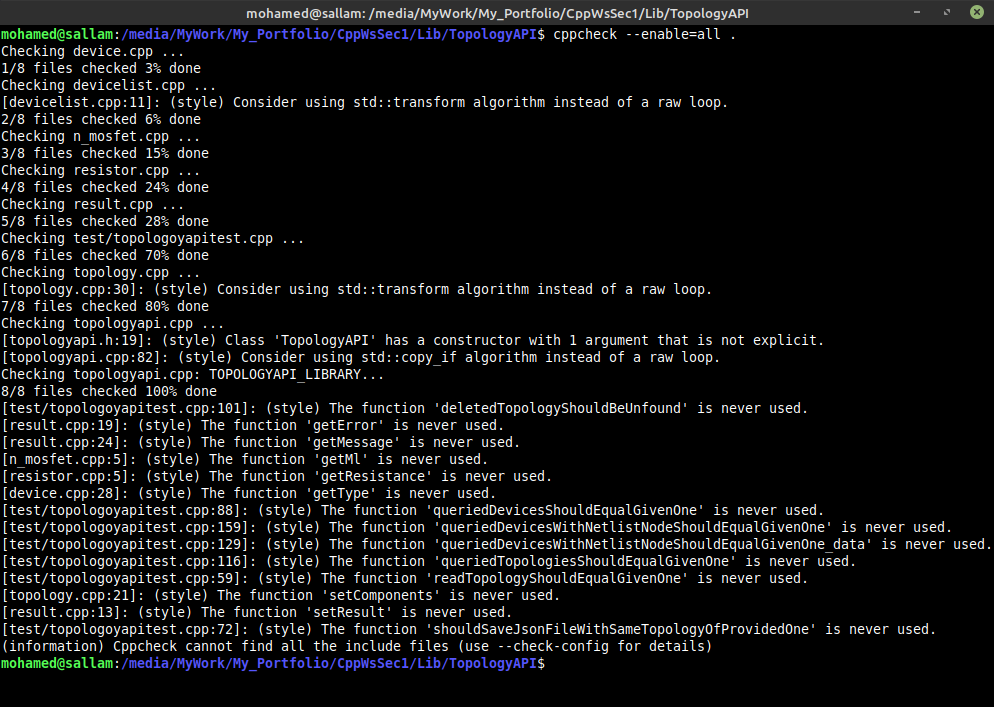
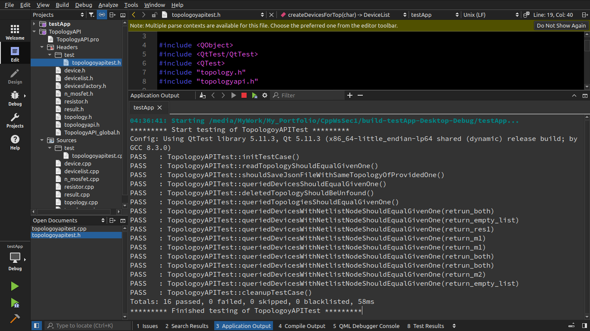

## Why should I NOT use C++?
I USED __C++__ BUT __JAVA__ WAS THE BEST CHOICE TO CREATE THIS LIBRARY, AND THAT IS WHY.

My first impression of the task about the programming language part was using ___Typescript___, which was the best choice because it's:-
1. human-readable -high level-
2. object-oriented 
3. a fork from ___JavaScript___, which means that is easy to use with JSON ("___JavaScript___" Object Notation)

But I decided to work with ___Qt___ and ___C++___ to be comfortable with what would be required from me to do in this internship and because:-
1. It's object-oriented.
2. It's faster than -almost- any OOP language.
3. It has JSON library, not as easy as ___TypeScript___ and ___Javascript___, but it's almost equivalent to what in use in ___Java___. 
4. It gives me control over memory better than any other OOP language.

Although ___Java___ was one of the choices at first because it's a level higher than __*C++*__ so a little bit __readability__ but I thought they are the same in this task because ___Qt___ gives me all libraries, I need, or this was, what I thought before __automatic testing__ part, which is __my first time to work with__, I realized that ___Java___ is the best because of ___Junit___, ___Mockito___ and generally its testing libraries. ___QtTest___ isn't that good, its documentation is weak and it loses a lot of features or maybe documentation of these features, at the end of the day, how could a developer know the existence of some features without good documentation of it. But unfortunately, __I realized that late after I wrote 90% of the task in _Qt_ and _C++_.__

## Managed Build Tool
I used _qmake_.

## Static Code Analysis Tool
I used _cppcheck_.
 

## `TopologyAPI` Class
### Description
`TopologyAPI` is an API responsible for the reading and writing topologies from and to disk, storing multiple topologies in memory, and executing operations on topologies such as deletion, querying a topology, and querying `DeviceList` by `topologyID` and/or `netlistNode`.

### Public Instance Methods
##### The constructor `TopologyAPI(TopologyList topologies)`: 
To create an instance of that class, you should provide `TopologyList` to store topologies in it.
##### `Result readJSON(const QString &fileName)`:
Read a topology from a JSON file and store it in `topologies` property, and returns `Result` which includes the error/success message and `bool`.
##### `Result writeJSON(const QString &topologyID, const QString &fileName)`:
Write a topology from `topologies` property to a JSON file by providing the `topologyID`, and the path and name of the file to be saved. It returns `Result` which includes the error/success message and `bool`.
##### `const TopologyList &queryTopologies()`:
Query about which topologies are currently in `topologies` property.
##### `Result deleteTopology(const QString &topologyID)`:
Delete a topology from `topologies` property by providing its ID. It returns `Result` which includes the error/success message and `bool`.
##### `DeviceList queryDevices(const QString &topologyID)`:
Query about which devices are in topology by providing `topologyID`.
##### `DeviceList queryDevicesWithNetlistNode(const QString &topologyID, const QString &netlistNode)`:
Query about which devices are connected to a given netlist node by by providing `topologyID` and `netlistNode`.

### Private Properties
##### `TopologyList topologies`
`std::shared_ptr` to list that API will fill it with topologies.

## `TopologoyAPITest` Class
### Description
Test class of `TopologyAPI` class. I use `QtTest` library provided by _Qt_. 

### Private Instance Methods
##### `DeviceList createDevicesForTop(char topologyNumber)`
Method to create devices for testing proposes.

### Private Slots
##### `void cleanup()`
It's a built-in function in `QTest`, which is called after each private slot to remove all elements in `topologies` property.
##### `void readTopologyShouldEqualGivenOne()`
It's a unit test for `TopologyAPI::readJSON()`, it reads `./topology.json` file from disk and compare the topology in it with an expected topology provided using `TopologoyAPITest::createDevicesForTop(1)`.
##### `void shouldSaveJsonFileWithSameTopologyOfProvidedOne()`
It's a unit test for `TopologyAPI::writeJSON()`, it saves the provided topology from memory to `./top1.json` file then read that file and compare the topology on it with the provided topology.
##### `void queriedDevicesShouldEqualGivenOne()`
It's a unit test for `TopologyAPI::queryDevices()`, it creates topology with given devices and stores it in memory, then tries to query those devices from memory again and compare it with the given device list.
##### `void deletedTopologyShouldBeUnfound()`
It's a unit test for `TopologyAPI::deleteTopology()`, it adds a given topology to the memory and checks if it really has been added then delete it and checks if it is still in memory or not.
##### `void queriedTopologiesShouldEqualGivenOne()`
It's a unit test for `TopologyAPI::queryTopologies()`, it adds 2 given topologies to the memory then query them and compare queried one with the one on the memory. 
##### `void queriedDevicesWithNetlistNodeShouldEqualGivenOne_data()`
It's a data provider method to `TopologyAPITest::queriedDevicesWithNetlistNodeShouldEqualGivenOne()` with `QTest` notation. It provides `topologyID`, `netlist` & `devices_expected` to test method.
##### `void queriedDevicesWithNetlistNodeShouldEqualGivenOne()`
It's a unit test for `TopologyAPI::queryDevicesWithNetlistNode()`, it takes `topologyID`, `netlist` & `devices_expected` and compare the expected device list with the generated one with `TopologyAPI::queryDevicesWithNetlistNode()`.

### Private Properties
##### `TopologyList topologies`
The list we use it to creates `TopologyAPI` object.
##### `TopologyAPI underTest`
An under test instance from `TopologyAPI`.

### Test Results
